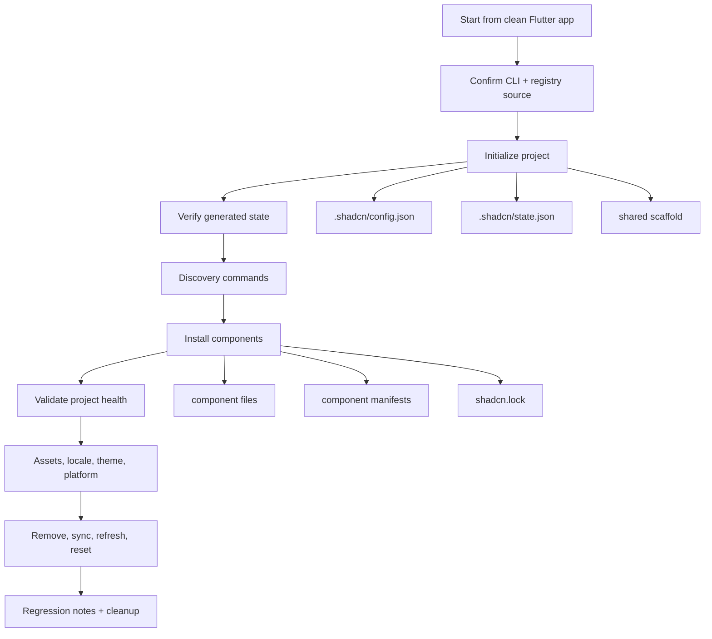

# CLI Manual QA Guide

This guide is for manually testing the whole `flutter_shadcn` CLI in a real Flutter app. It is not a user tutorial. Treat it as a QA map: every command family gets a pass, every pass has expected evidence, and failures should be recorded with the command, exit code, and project diff.

Use a disposable Flutter app for every run. Never run destructive commands such as `project reset` against an app you care about.

## Visual Map



## Fast Automated Smoke

Run this first. It creates a temporary Flutter app, initializes the CLI against a local copy of the real registry, installs representative components, runs `flutter pub get`, checks generated files, and reports `flutter analyze`.

```bash
tool/cli_manual_smoke.sh \
  --registry-root /absolute/path/to/shadcn_flutter_kit/flutter_shadcn_kit/lib/registry \
  --keep
```

Use strict analyzer mode only when the registry is expected to be analyzer-clean:

```bash
tool/cli_manual_smoke.sh \
  --registry-root /absolute/path/to/shadcn_flutter_kit/flutter_shadcn_kit/lib/registry \
  --strict-analyze
```

Expected smoke evidence:

| Check | Evidence |
| --- | --- |
| CLI starts | `flutter_shadcn_cli version ...` |
| Init works | `.shadcn/config.json`, `.shadcn/state.json`, shared theme files |
| Registry discovery works | `list`, `search`, `info`, and `dry-run` complete |
| Install works | `.shadcn/components/<id>.json`, component Dart files, `shadcn.lock` |
| App dependencies resolve | `flutter pub get` succeeds |
| Analyzer health | warnings/errors are printed; strict mode fails on any analyzer issue |

The smoke script builds a local symlink overlay because the real registry stores manifests under `registry/` while inline init actions copy from `shared/`. The overlay keeps both source layouts available without modifying the registry checkout.

## Manual Run Setup

Create a clean app:

```bash
flutter create shadcn_cli_manual_test
cd shadcn_cli_manual_test
flutter pub get
```

Pick the registry mode before testing.

| Mode | Use When | Command Shape |
| --- | --- | --- |
| Published registry | You want to test the public default registry path | `flutter_shadcn init --yes` |
| Local real registry | You are testing the local `shadcn_flutter_kit` checkout | `flutter_shadcn --advanced ... --registry-path <overlay>/registry` |
| Fixture registry | You need deterministic failure/recovery tests | Use a small local registry fixture |

For local real-registry testing, create the same overlay used by the smoke script:

```bash
REGISTRY_ROOT=/absolute/path/to/shadcn_flutter_kit/flutter_shadcn_kit/lib/registry
QA_ROOT=$(mktemp -d /tmp/flutter_shadcn_manual.XXXXXX)
mkdir -p "$QA_ROOT/source_overlay"
ln -s "$REGISTRY_ROOT" "$QA_ROOT/source_overlay/registry"
ln -s "$REGISTRY_ROOT/shared" "$QA_ROOT/source_overlay/shared"
ln -s "$REGISTRY_ROOT/manifests" "$QA_ROOT/source_overlay/manifests"
```

Then run commands with:

```bash
flutter_shadcn --advanced <command> --registry-path "$QA_ROOT/source_overlay/registry"
```

## Pass 1: CLI Starts

```bash
flutter_shadcn version
flutter_shadcn --help
flutter_shadcn init --help
flutter_shadcn add --help
```

Expected:

- Version prints without crashing.
- Public help hides developer-only flags.
- `--advanced` help shows advanced/developer flags.

## Pass 2: Init

```bash
flutter_shadcn --advanced init \
  --registry-path "$QA_ROOT/source_overlay/registry" \
  --skip-integrity \
  --yes
```

Expected:

- `.shadcn/config.json` exists.
- `.shadcn/state.json` exists.
- Shared files exist under `lib/ui/shadcn/shared`.
- `pubspec.yaml` contains declared dependencies/assets.
- Init can be repeated without duplicating dependencies or corrupting state.

Evidence commands:

```bash
find .shadcn -maxdepth 3 -type f | sort
find lib/ui/shadcn/shared -maxdepth 4 -type f | sort | sed -n '1,80p'
flutter pub get
```

## Pass 3: Discovery

Run text and JSON variants:

```bash
flutter_shadcn --advanced list --registry-path "$QA_ROOT/source_overlay/registry"
flutter_shadcn --advanced search button --registry-path "$QA_ROOT/source_overlay/registry"
flutter_shadcn --advanced info button --registry-path "$QA_ROOT/source_overlay/registry"
flutter_shadcn --advanced dry-run button --registry-path "$QA_ROOT/source_overlay/registry"
```

Expected:

- `list` shows the registry component count.
- `search button` returns `button`.
- `info button` shows metadata and import path.
- `dry-run button` prints planned files without creating component files.

JSON output should be valid. If warnings are printed before JSON, record it as an output-format defect.

## Pass 4: Component Install

Install one simple component and two dependency-heavy components:

```bash
flutter_shadcn --advanced add button --registry-path "$QA_ROOT/source_overlay/registry"
flutter_shadcn --advanced add card alert --registry-path "$QA_ROOT/source_overlay/registry"
```

Expected:

- Component files exist under `lib/ui/shadcn/components/...`.
- `.shadcn/components/button.json`, `.shadcn/components/card.json`, and `.shadcn/components/alert.json` exist.
- `shadcn.lock` records installed components and files.
- Shared dependencies required by installed files are present.
- Re-running the same add command is idempotent.

Evidence commands:

```bash
find lib/ui/shadcn/components -maxdepth 5 -type f | sort | sed -n '1,120p'
find .shadcn/components -type f | sort
cat shadcn.lock
flutter pub get
flutter analyze
```

## Pass 5: Remove And Sync

```bash
flutter_shadcn remove card
flutter_shadcn sync
flutter_shadcn audit
flutter_shadcn deps
```

Expected:

- `remove card` removes only files owned by `card`.
- Shared files still needed by `button` or `alert` remain.
- `sync` preserves manifests and lockfile ownership.
- `audit` and `deps` do not crash.

## Pass 6: Locale

```bash
flutter_shadcn locale init
flutter_shadcn locale init
```

Expected:

- First run creates `l10n.yaml` and `lib/l10n/app_en.arb`.
- Second run fails cleanly because `l10n.yaml` already exists.
- Component-local locale resources merge only when a component declares them.

## Pass 7: Assets

```bash
flutter_shadcn assets --list
flutter_shadcn assets --typography
flutter_shadcn assets --icons
flutter_shadcn assets --all
```

Expected:

- Asset commands use inline registry actions.
- Installed files match `pubspec.yaml` assets.
- Missing or unsupported asset groups fail clearly without partial writes.

## Pass 8: Theme

```bash
flutter_shadcn theme --list
flutter_shadcn theme --apply amber-minimal
```

Expected:

- Theme list loads from the registry theme index.
- Apply writes only declared generated theme artifacts.
- Hash/path validation happens before writes.
- `.shadcn/config.json` records the selected theme.

## Pass 9: Registries And Namespaces

```bash
flutter_shadcn registries
flutter_shadcn default
flutter_shadcn default shadcn
flutter_shadcn list @shadcn
flutter_shadcn info @shadcn/button
flutter_shadcn info shadcn:button
```

Expected:

- Namespace-qualified and colon-qualified addresses resolve to the same component.
- Unqualified `add button` fails if multiple enabled registries expose `button`.
- `default` updates only `.shadcn/config.json`.

## Pass 10: Diagnostics And Recovery

```bash
flutter_shadcn doctor
flutter_shadcn validate
flutter_shadcn project refresh
flutter_shadcn project reset
flutter_shadcn project reset --undo
flutter_shadcn reset
```

Expected:

- `doctor` reports registry, paths, schema, lockfile, and platform targets.
- `validate` reports schema/source issues without mutating the project.
- `project refresh` repairs missing managed scaffold files.
- `project reset` snapshots managed files before deleting.
- `project reset --undo` restores within the undo window.
- Global `reset` does not delete project files.

## Pass 11: Negative Cases

Run these in a disposable app or fixture registry:

| Case | Command | Expected |
| --- | --- | --- |
| Bad registry path | `flutter_shadcn --advanced list --registry-path /missing` | Non-zero, clear error |
| Invalid schema | Fixture with invalid `components.json` | Non-zero schema error |
| Path traversal | Fixture with `../escape.dart` destination | Rejected before writes |
| Duplicate component ID | Two enabled registries expose `button`; run `add button` | Fails with namespace ambiguity |
| Dependency conflict | App already has conflicting pubspec dependency | Fails before component writes |
| Remove dependent | Install dependency graph, remove required base component | Fails unless force behavior is explicitly tested |

## Triage Format

For every failure, record:

```text
Command:
Exit code:
Expected:
Actual:
Registry source:
Generated files changed:
Analyzer output:
Notes:
```

Classify failures:

| Class | Meaning |
| --- | --- |
| CLI bug | Command behavior violates the CLI contract. |
| Registry metadata bug | Files install, but manifests miss dependencies, paths, schema entries, or locale/assets metadata. |
| Registry source bug | The registry file itself does not compile or imports missing source. |
| App environment bug | Flutter/Dart SDK, platform tools, or local pub cache caused the failure. |

## Completion Criteria

A full manual pass is complete when:

- Smoke script passes init/add/file checks.
- Init, discovery, add, remove, locale, assets, theme, registry, diagnostics, and recovery command families were exercised.
- `flutter pub get` succeeds after install.
- `flutter analyze` output is either clean or every issue is classified.
- Any JSON command produces parseable JSON without warning text mixed into stdout.
- The final app can be deleted and the same pass can be repeated from a clean app.
